# The IPFS User Interface Project

> Defining the ideal UI/UX for IPFS Desktop, Companion, & WebUI

We want to make IPFS GUIs beautiful, reusable, and unified. To do this, we’ll gather together a list of the features that appear in Desktop, Companion and WebUI, compare their implementations, and find consensus on the ideal way to offer up each concept to the users.

With that list agreed, we’ll then **define the purpose and scope of each app**, and how it’s feature set integrates with the other apps. We don’t want each app to duplicate the entire feature set of the others, but each app should have enough functionality to be useful in isolation. Each app has to work within different constraints. A desktop app has greater freedom in its implementation than a browser WebExtension. We’ll optimise each app to make best use of the resources available.

From there, we’ll design wireframes for each app, composing them from the list of ideal features, finding the UI/UX patterns that can be reproduced across the differing deployment environments. The goal here is not to force each app to be identical, but to come up with a common visual language, where the same feature looks familiar and behaves in a predictable way across all the apps, while the overall layout will be adapted to work best for the context. _The frame may change, but the buttons will work the same._

See the [IPFS GUI Project Description](https://docs.google.com/document/d/1HzwTYo4BDDH4WIh0EULh0U9_WnT84FacDUdVtTExluQ/edit?usp=sharing) document for the original definition of this project.

## App Navigation

WebUI and Desktop share a similar sidebar navigation style. They have different names for sections and sections are not in the same order. WebUI offers a DAG explorer, while Desktop offers a hash Pinning section.

Companion is a browser action, so presents a drop-down menu, with context sensitive options. It again offers different initial options, and has it's own names for things.

| webui      | desktop        | companion         |
|------------|----------------|-------------------|
| |||
| Home | Info | _Node type toggle_ |
| Connections | Files | Share files via IPFS |
| Files | Pin | Open WebUI |
| DAG | Peers | Open Preferences |
| Config | Settings | Switch to public gateway |

Each of these will be explored in more detail below.

A quick win would be to agree on the names of things, and their order of importance in a nav bar. For example we have Config, Settings and Open Preferences, to denote a similar action in all three apps. Of note WebUI is referring to it's IPFS node config, while Desktop is referring to app specific settings, like "launch at start up". Companion is referring to a similar concept as Desktop, as it also takes you to to add-on specific settings.

## IPFS Node info

All three apps show IPFS node stats as part of the initial UI that is show the user first, at startup.

| | webui      | desktop        | companion         |
|-|------------|----------------|-------------------|
| | |||
| **nav section** | Home | Info | - |
| **title** | NODE INFO | Your Node | - |

Let's dig into what is shown in each app...

### WebUI > Home > NODE INFO

- Peer ID: a raw QmHash
- Location: "Northwich, C5, United Kingdom, Earth"
- Agent Version: `go-ipfs/0.4.13/`
- Protocol Version: `ipfs/0.1.0`
- Public Key: raw key string.
- Network Addresses: A list of `multiaddr`s

The WebUI interface assumes the user is technically savvy and already familiar with IPFS concepts. I assume the network addresses are the interfaces my local daemon is listening on, but seeing addresses in `multiaddr` format is still new to me, so this all needs some explaining.

Then there is the geocoded `Location`. It's fun, but has never been correct for me. We should consider if this is helpful or confusing, as it's not accurate. Perhaps it's accuracy should be limited to the country level if we think it's worth keeping. Including it at all, might be sending the wrong message as it initially looks like IPFS is tracking me.

`Peer ID` is interesting. My address on the distributed web. This would benefit from some explaining as it's a concept we want to teach the users about. I'm not clear on why we show raw `Public Key` there as well.

The `agent` & `protocol` version occupy prime UI space, front and center when you launch the app. This sort of info is normally place in an about menu; it's main use is debugging and issue reporting.

There is then a section `NETWORK ADDRESSES` which shows the network interfaces that my node is bound to. These are presented in `multiaddr` form, which is new to most people, so would benefit from explaination, or moving off to a diagnostics page, rather than presenting them as the part of the initial user experience.

Web UI has some useful meta-nav items for:

- About ipfs - alas this just links to the ipfs.io homepage at the moment, but it's a nice idea to have an in app help and onboarding link available.
- GitHub repo - That open-source issues list wont fix itself.
- Report a bug - This is really nice. It jumps the user straight to the github create an issue page.
- Enter a hash or path - This let's you paste in a CID and opens it in the DAG explorer tab to show the object links... the file list and their hashes in the case that the hash points to a directory.

**These items are absent from IPFS comapanion and desktop and should be considered.**

### Desktop > Info > Your Node

- Repo size. Storage space used in MB.
- Sharing [n] "objects". - What are objects? Files? dag nodes?
- Peer ID: a raw QmHash
- Location: "Northwich, C5, United Kingdom, Earth"
- Bandwidth Used - Size in MB

Other items are available, but only appear on scroll. I only found that out after a few weeks of usage. We need to reconsider the layout or find a clear visual cue to show the user there are more items.

`Repo size` - in MB - This is surprising. Files added to an IPFS repo that aren't in the MFS will be counted in the repo size, but don't appear in the Files pane, so as a user I can't see how the numbers make sense.

`Sharing [n] "objects"` - What are objects in this context? Files? IPLD nodes? What would a new user assume? How can we make this more intuitive? Is it useful?

`Location` - Same as WebUI. Fun, but we should consider if this is helpful or confusing, as it's not accurate. Perhaps it's accuracy should be limited to the country level if we think it's worth keeping.

`Bandwidth used` Tell the user the time frame. Since when? right now? Today? Ever? Probably needs to be a chart and ability to throttle like in Transmission.

`Up/Down speed` What's using my bandwidth? Which hashes? or is it just DHT noise?

`protocol version` ipfs/0.1.0... as per WebUI, This is diagnostics info, not front page material.

`Addresses` - This is presented as a list of `multiaddr`s that is change every second. We need to identify what value this provides to the user and possibly remove it.

`Public key` - A raw public key. What do can i do with it? What is the relationship to my Peer Id. Why show both?

### Companion > Browser action menu stats

| External node | Emedded node |
|---------------|--------------|
| | 

- GATEWAY - the http address of the IPFS gateway you are using.
- API - the http address of the IPFS API you are using.
- VERSION - the version of the ipfs api impl as reported by `ipfs.version()`
- PEERS - The current number of connected peers.

The stats in companion are significantly different to those in Desktop and WebUI. They are more focused on showing you _which_ ipfs node you are talking to.

## Add Files

All three apps provide drag'n'drop and and a file picker dialog to add a file.

| webui | desktop | companion |
|-------|---------|-----------|
|  | 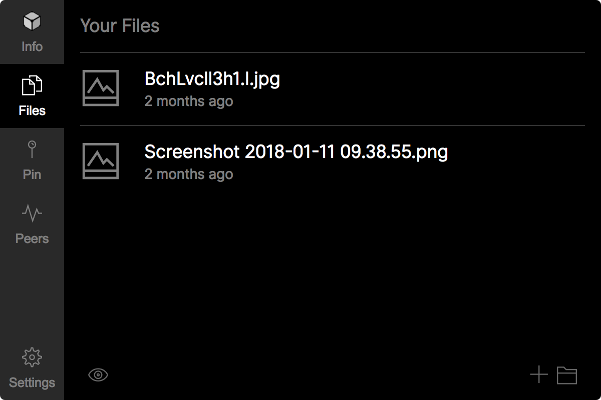 | 

**WebUI** provides a demarked file-drop area with a button to launch a native file picker dialog. No explanation is provided.

| webui pre-file-drop | webui post-file-drop |
|---------------------|----------------------|
|  | 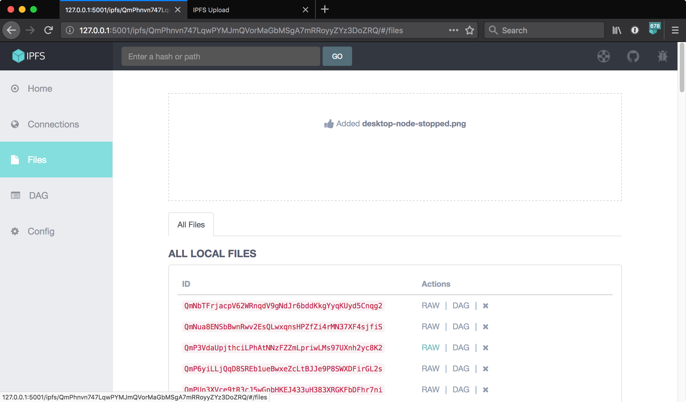 |

Dropping a file gives positive feedback but nothing you can click on to see the file in the file list.

**Adding large file (~300MB) causes an error.** A `allocation size overflow` error from `ipfs-webui` in the browser console, and no indication of what happened in the UI.

**Desktop** let's you drop files anywhere on it, but provides no indication that it's possible. Dropping a file works well as the file list shows filenames and is ordered by date added, so the file you just dropped appears at the top of the list.

Adding a large file is handled, showing an indeterminate progress bar, which helps inform the user that something is happening.

| desktop during-file-drop | desktop post-file-drop |
|---------------------|----------------------|
| 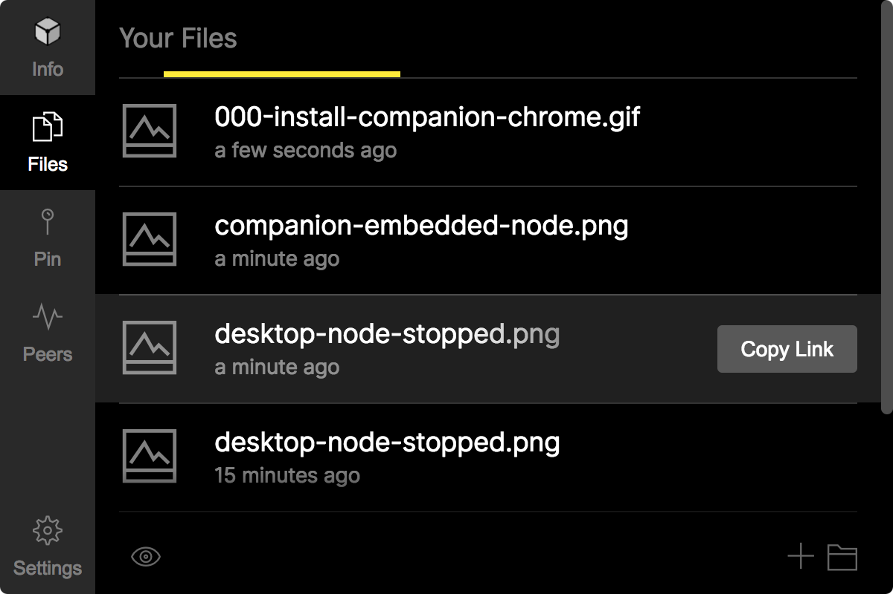 | 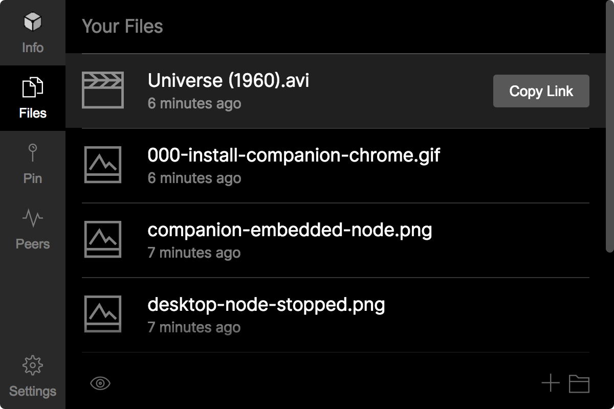 |

There are 2 buttons in the bottom left of the Files pane to open a native file picker dialog. The `+` opens the dialog configured to allow you to pick a single file. The folder icon opens a dialog configured to allow only directories to be selected. This should be collapsed into a single feature.

**Companion**  similar to webUI provides a demarked file-drop area with a button to launch a native file picker dialog. Companion calls the feature "Share files via IPFS" and shows the connected peers count.

| companion pre-file-drop | companion post-file-drop |
|---------------------|----------------------|
|  | 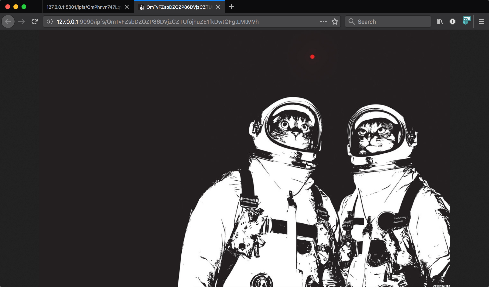 |

The current tab redirects to the url for the file just added. Adding a large file is handled, as the filepicker is a standard html file input. There is no progress indication; the usual browser page loading indicators give a clue that something is happening.

## Sharing files

**WebUI** offers nothing to help the user share a file in their repo. The file list presents a list of CIDs that the user can copy and paste, and manually edit to point to the gateway.

**Desktop** offers a "Copy link" button when the user hovers over a file. Clicking copies the IPFS gateway address of the file to the users clipboard. No indication is given that the action succeeded. No other controls are provided, to edit or remove files.

**Companion** adds extra sharing related links to the menu when the current tab is showing a file from IPFS. "Copy Canonical Address", copies a Nested URI `/ipfs/QmHash` address to the clipboard. "Copy Public Gateway URL", copies the full ipfs.io url for the file. Both indicate that it worked with a browser notification. There is no indication to the user that these extra features exist, they only see them by re-opening the ifps browser action menu.

## Browsing files

**WebUI** list files by CID. It's not clear what order they are sorted in. Links are provided to open each file in a browser, or explore IPLD (labelled as DAG) data for the node are provided, along with a "x - remove" link.

**Desktop** lists files by filename, sorted with most recently added at the top. The time the file was added is provided as muted, secondary text. In the 0.3, you can't drill down into folders, though I think this feature is available in the latest dev version.

**Companion** has no file browsing feature.

## Connections / Peers

Desktop and WebUI both have a page for showing info about all the other IPFS nodes you are currently connected to.

| webui | desktop |
|-------|---------|
| 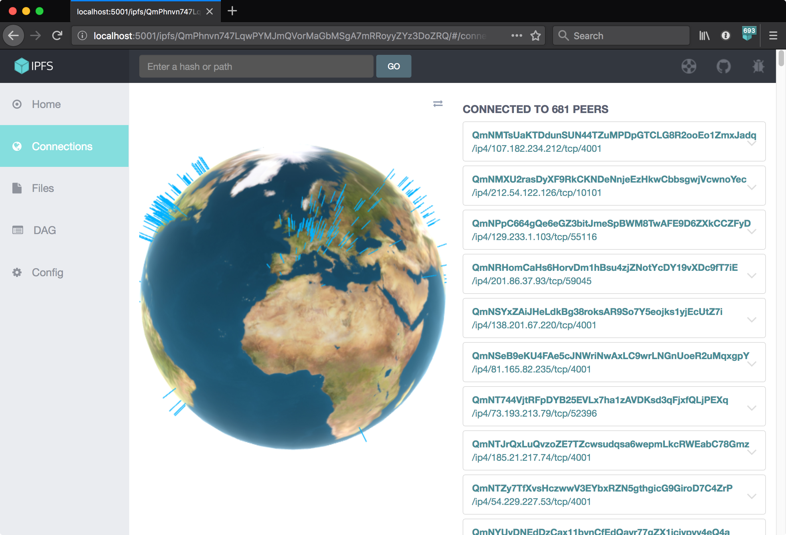 | 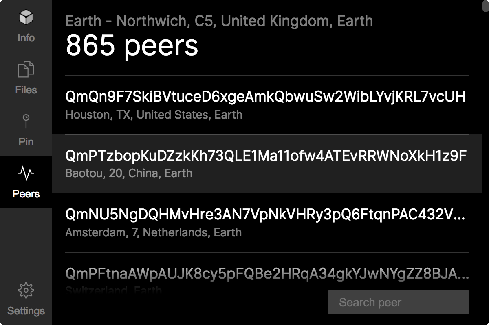 |

**WebUI** shows a peer count, geolocated pins on a globe and list of Peer Id / Multiaddr pairs for each connection. Clicking on a list item expands it to show similar node info as show on the Home page about your local node. The process is resource intensive and causes "slow script" warnings in firefox.

**Desktop** Shows your location and peer count, along with a list of Peer Id / Location pairs. No more info is available about the peers. There is a search bar that allows you to search for peers by id or location.

**Companion** shows just the number of connected peers as a menu bar stat, and again when you go to share a file.

## DAG / IPLD Explorer

**WebUI** has a DAG explorer, which might be due a rename to "IPLD Explorer". It takes an IPFS hash (also due a rename to CID) and lists out all the links or data that in the object the CID points to. In the case of a directory, you can see a list of the files it contains, and each filename is a link to it's IPLD object, allowing you drill down, navigating through the links. Where a hash points to data, the raw data is rendered in plain text.

| Empty state | Explore a cid | Drill into a data node |
|-|-|-|
|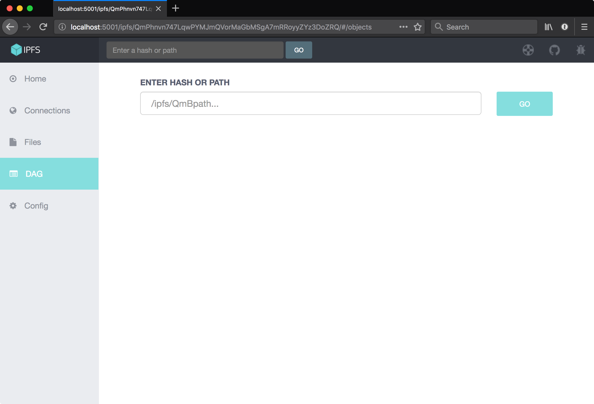 |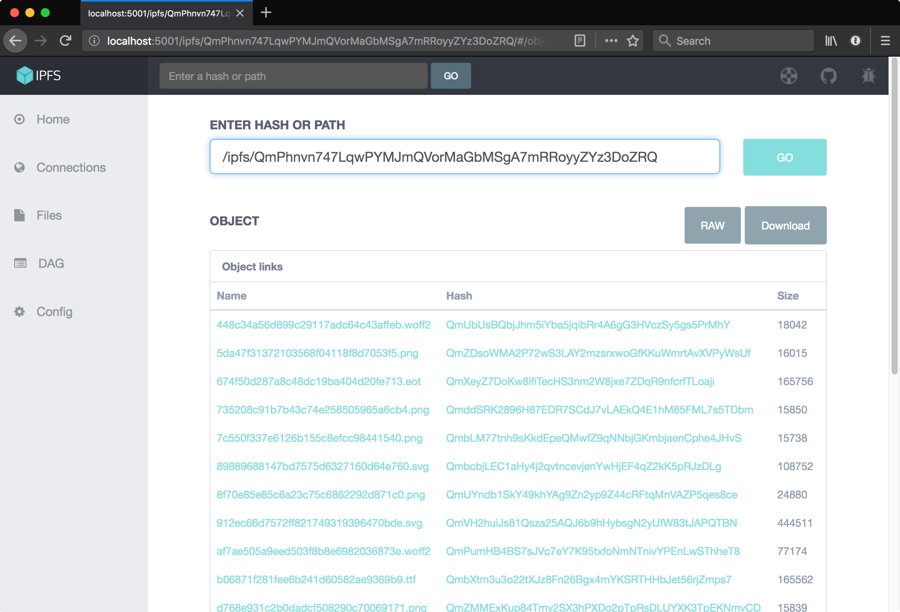 |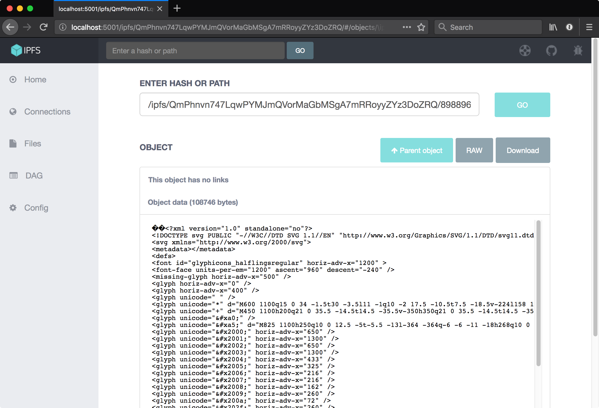

The UI/UX should be improved but the idea is interesting, and could become a vital tool for helping people to understand IPFS and IPLD.

## Pinning

**Desktop** allows you to pin a CID. You don't need to aleady store that content. You can paste in any CID and give it a label to remind yourself what it was.

| Desktop pin pane | Add a pin |
|------------------|-----------|
| 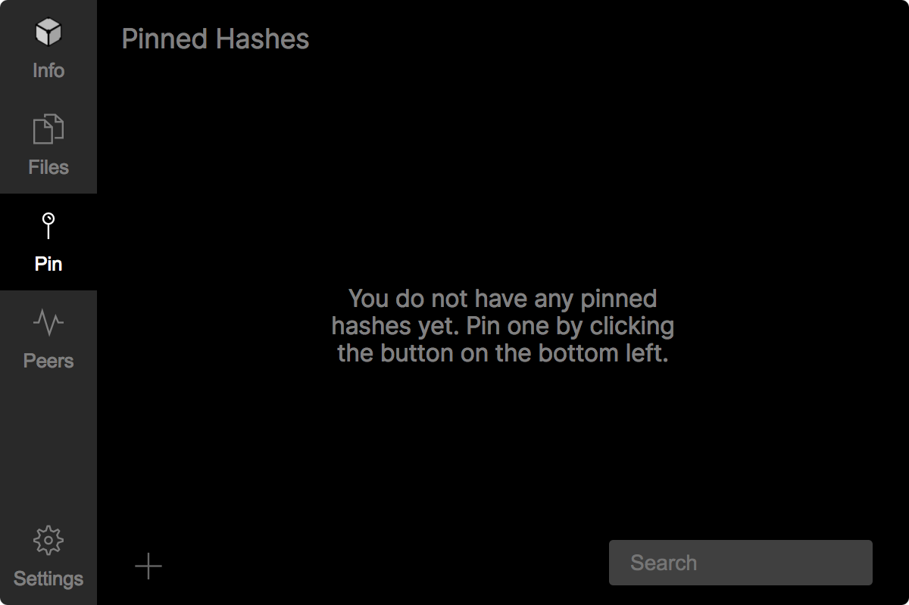 | 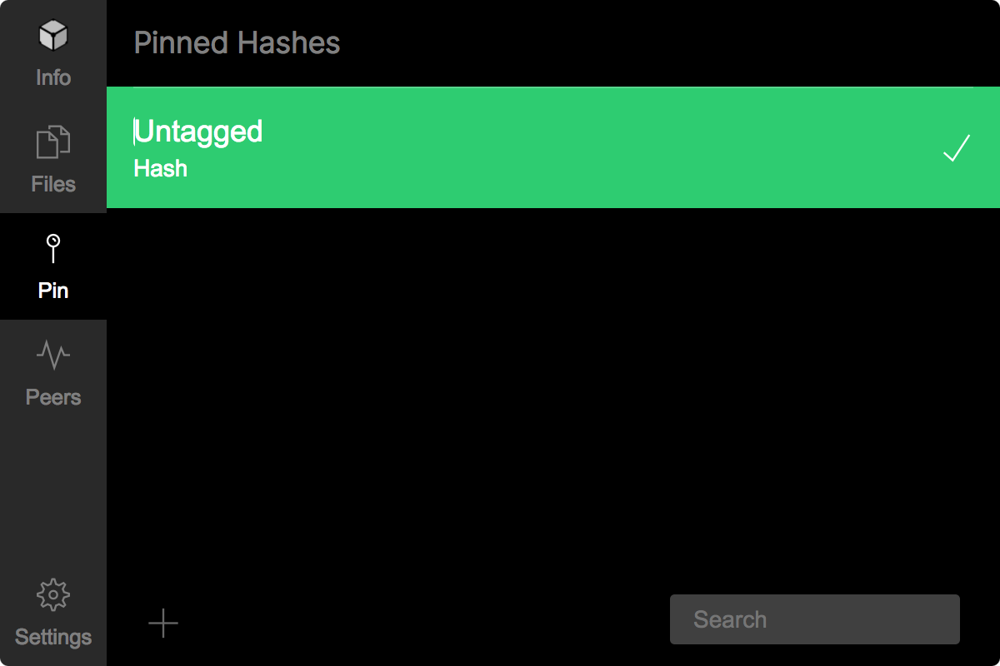 |

| Filled out form | PIN in progesss
|-----------------|------------------|
| 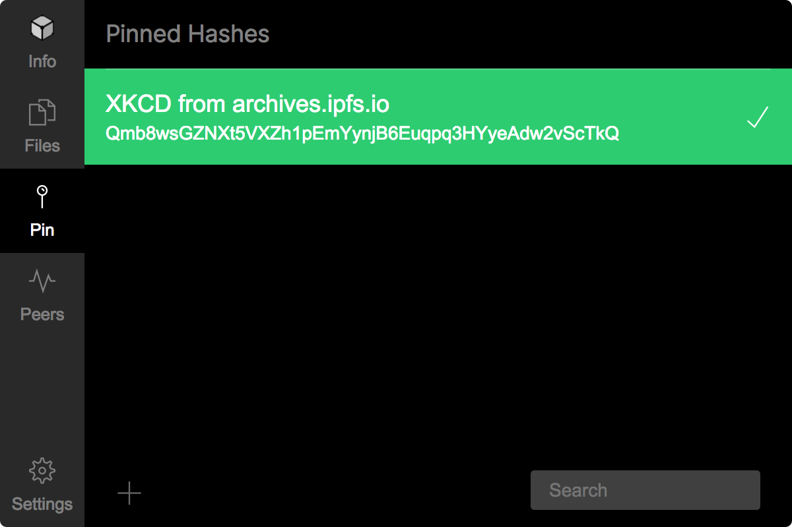 | 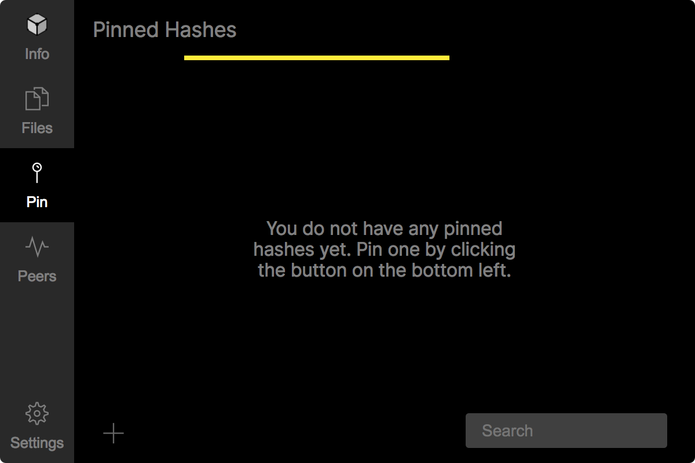 |

A use-case for this is the [data-together](https://datatogether.org/) idea of sharing the hosting of content you feel is important. You can go to https://archives.ipfs.io/ and grab a hash for a dataset and replicate it all to your repo, to add more copies of it to the network and increase it's availability.

More simply, you could use it. make sure a website you want to host is always available on your machine.

All of this needs explaining, ideally in app, as it's a new way of thinking about content on the distributed web.

## Open WebUI

Both Desktop and Companion offer this, but is "Open WebUI" the right name for this action? As a companion or desktop user, I may have never seen the WebUI app, and so may have no intuitions as to what it's for.

Desktop and companion have differing ideas as to what the best url for WebUI is.

desktop:
http://localhost:5001/ipfs/QmPhnvn747LqwPYMJmQVorMaGbMSgA7mRRoyyZYz3DoZRQ/#/

ipfs companion
http://127.0.0.1:5001/ipfs/QmPhnvn747LqwPYMJmQVorMaGbMSgA7mRRoyyZYz3DoZRQ/#/

## IPFS Node Config vs Settings / Open Preferences

TODO: Talk about app settings vs IPFS node settings. WebUI only has node settings right now. Desktop and companion have to deal with app specific settings and IPFS node config too, so we need to think about how to explain the difference t0 the user, or otherwise folding the two concepts into one settings page (app + node settings.) As mentioned previously, we should standardize the naming of these sections.

## Start / Stop IPFS Node

Desktop let's you start and stop your IPFS node. Companion and WebUI don't

In Desktop the control is shown as a the `Power` icon, bottom right. It's not clear that that is it's purpose. I initially thought it was a fancy quit this app button.

Using it fades out the node info, but it isn't clear what's happened, or that toggling the same button will bring it back to life. The other tabs show no indication that the node is stopped, and attempting to add a file causes an error.

## Control which IPFS node you connect to

Companion let's you toggle between an embedded js-ipfs node or an external IPFS daemon. In the preferences you can even have it connect to a remote IPFS node.

Desktop uses [`js-ipfsd-ctl`](https://github.com/ipfs/js-ipfsd-ctl) and bundles `go-ipfs`, and it's not configureable. If you run a local ipfs daemon, Desktop cannot start, and instead shows an error message, "Please stop your IPFS daemon before running this application".

WebUI is bundled with `go-ipfs` and only talks the IPFS node it was bundled with. It would be useful to have a WebUI that was portable, so it could be used with `js-ipfs`.

## Installation

The user journey starts with the install steps, so we should consider what we can do to make that process as seamless as possible.

#### Installing Companion in Firefox

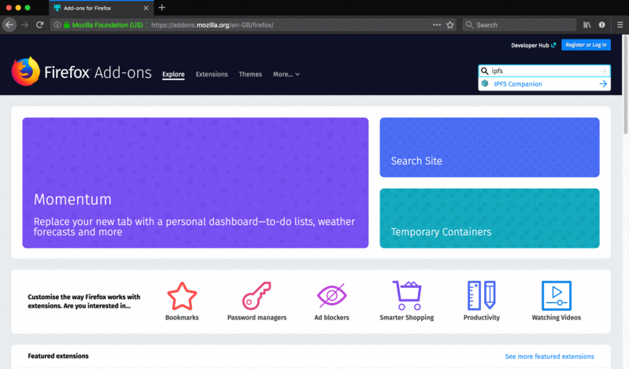

#### Installing Companion in Chrome

#### Installing Desktop on MacOS

| Download from Github. Open .dmg | Find in Applications, click, deal with warning. |
|----------------------|------------------------|
|  |  |

TODO:
- ipfs-desktop - windows
- ipfs-webui - shell

## Interesting features that we should talk about

**DAG Explorer instead of a search bar**. Paste in a CID, see info about it. This seems it could be hugely useful for letting people play with IPLD and IPFS to build an intuition of how it fits together.

**Share file link**. The most useful link to share right now is an url to a gateway. Anyone running Companion could resolve it via ipfs, and anyone not would have a working fallback. Presenting multiple options, one of which would require all your collegues to also be already using ipfs to work seems unhelpful at this point.

