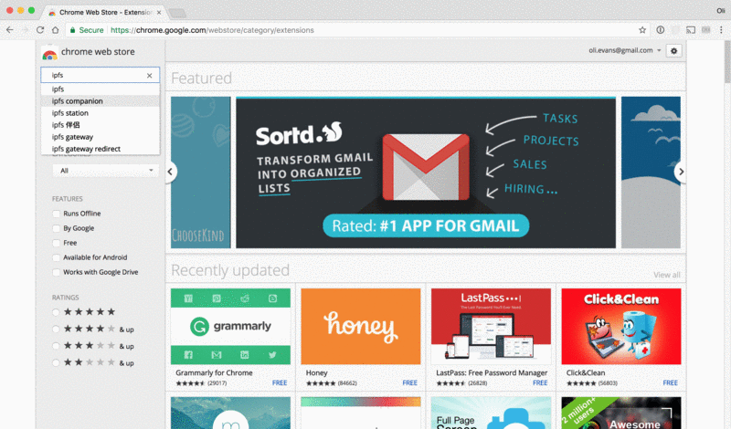
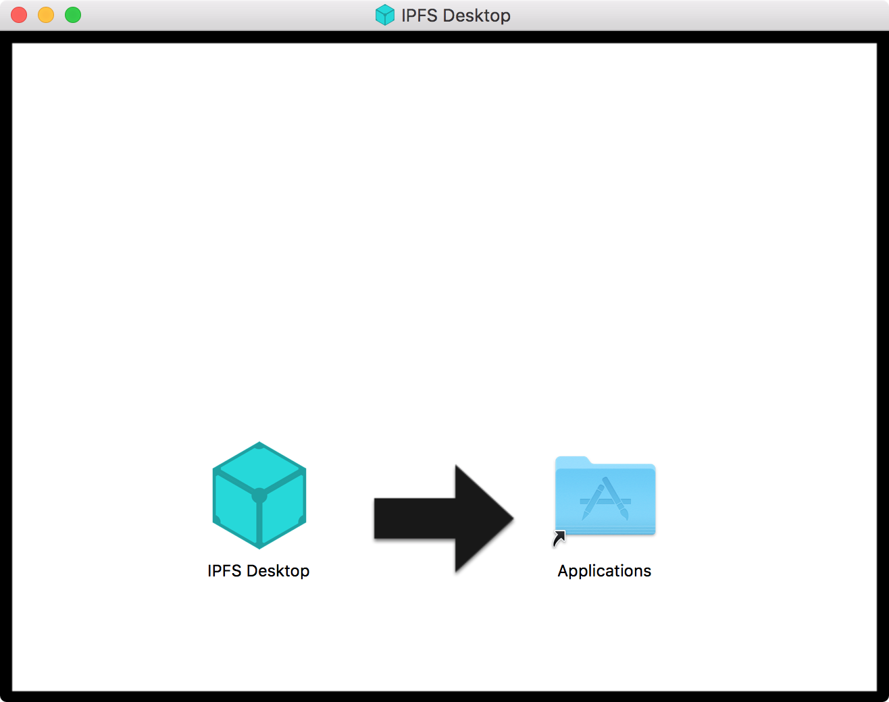

# The IPFS User Interface Project

> Defining the ideal UI/UX for IPFS Desktop, Companion, & WebUI

We want to make IPFS GUIs beautiful, reusable, and unified. To do this, we’ll gather together a list of the features that appear in Desktop, Companion and WebUI, compare their implementations, and find consensus on the ideal way to offer up each concept to the users.

With that list agreed, we’ll then **define the purpose and scope of each app**, and how it’s feature set integrates with the other apps. We don’t want each app to duplicate the entire feature set of the others, but each app should have enough functionality to be useful in isolation. Each app has to work within different constraints. A desktop app has greater freedom in its implementation than a browser WebExtension. We’ll optimise each app to make best use of the resources available to it.

From there, we’ll design wireframes for each app, composing them from the list of ideal features, finding the UI/UX patterns that can be reproduced across the differing deployment environments. The goal here is not to force each app to be identical, but to come up with a common visual language, where the same feature looks familiar and behaves in a predictable way across all the apps, while the overall layout will be adapted to work best for the context. _The frame may change, but the buttons will work the same._

See the [IPFS GUI Project Description](https://docs.google.com/document/d/1HzwTYo4BDDH4WIh0EULh0U9_WnT84FacDUdVtTExluQ/edit?usp=sharing) document for the original definition of this project.

## App Navigation

WebUI and Desktop have similar sidebar navigation styles, but have different names for sections, sections have different ordering. WebUI offers a DAG explorer, while Desktop offers a hash Pinning section.

Companion is a browser action, so presents a drop-down menu, with context sensitive options. It again offers different initial options, and has it's own names for things.

| webui      | desktop        | companion         |
|------------|----------------|-------------------|
| |||
| Home | Info | _Node type toggle_ |
| Connections | Files | Share files via IPFS |
| Files | Pin | Open WebUI |
| DAG | Peers | Open Preferences |
| Config | Settings | Switch to public gateway |

Each of these will be explored in more detail below.

A quick win would be to agree on the names of things, and their order of importance in a nav bar. For example we have Config, Settings and Open Preferences, to denote a similar action in all three apps. Of note WebUI is referring to it's IPFS node config, while Desktop is referring to app specific settings, like "launch at start up". Companion is referring to a similar concept as Desktop, as it also takes you to to add-on specific settings.

## IPFS Node info

All three apps show some IPFS node stats as part of the initial interface show to the user

| | webui      | desktop        | companion         |
|-|------------|----------------|-------------------|
| | |||
| **nav section** | Home | Info | - |
| **title** | NODE INFO | Your Node | - |

### Node info - WebUI

- Peer ID: a raw QmHash
- Location: "Northwich, C5, United Kingdom, Earth"
- Agent Version: `go-ipfs/0.4.13/`
- Protocol Version: `ipfs/0.1.0`
- Public Key: raw key string.
- Network Addresses: A list of `multiaddr`s

WebUI is very technical, and assume the user is already familiar with IPFS concepts. I assume the network addresses are the interfaces my local daemon is listening on, but seeing addresses in `multiaddr` format is still new to me, so this all needs some explaining.

Is the geocoded `Location` useful to anyone? It's fun, but has never been correct for me. It might be sending the wrong message as it initially looks like IPFS is tracking me.

`Peer ID` is interesting. My address on the distributed web. Would benefit from some explaining as it's a concept we want to teach the users about.

The `agent` & `protocol` version occupy prime UI space, front and center when you launch the app. This sort of info is normally place in an about menu; it's main use is debugging and issue reporting.

Web UI has some useful meta-nav items for:

- About ipfs - alas this just links to the ipfs.io homepage at the moment, but it's a nice idea to have an in app help and onboarding link available.
- GitHub repo - That open-source issues list wont fix itself.
- Report a bug - This is really nice. It jumps the user straight to the github create an issue page.

**These items are absent from IPFS comapanion and desktop and should be considered.**

### Node info - Desktop

- Repo size. Storage space used in MB.
- Sharing [n] "objects". - What are objects? Files? dag nodes?
- Peer ID: a raw QmHash
- Location: "Northwich, C5, United Kingdom, Earth"
- Bandwidth Used - Size in MB

Other items are available, but only appear on scroll. On macos, there's no scrollbar so I only found that out after a few weeks of usage. We need to find a visual cue to show the user there are more items, or reconsider the layout.

`Repo size` - in MB - This is surprising. Files added to an IPFS repo that aren't in the MFS will be counted in the repo size, but don't appear in the Files pane, so as a user I can't see how the numbers make sense.

`Sharing [n] "objects"` - What are objects in this context? Files? DAG nodes? What would a new user assume? How can we make this more intuitve? Is it useful?

`Location` - Same as WebUI. Fun, but we should consider if this is helpful or confusing, as it's not accurate. Perhaps it's accuracy should be limited to the country level if we think it's worth keeping.

`Bandwidth used` Tell the user the time frame. Since when? right now? Today? Ever? Probably needs to be a chart and ability to throttle like in Transmission.

`Up/Down speed` What's using my bandwidth? Which hashes? or is it just DHT noise?

`protocol version` ipfs/0.1.0... as per WebUI, This is diagnostics info, not front page material.

`Addresses` - This is presented as a list of `multiaddr`s that is change every second. We need to identify what value this provides to the user and possibly remove it.

`Public key` - A raw public key. What do can i do with it? What is the relationship to my Peer Id. Why show both?

`Node settings` - This doesn't work for me. It suggests it'll let me edit my IPFS node config, but is presented inline in the same way as stats

`Open WebUI`

There is also the `Power` icon, bottom right, that lets you stop your ipfs node. It's not clear that that is it's purpose. I initially thought it was a fancy quit this app button. Using it fades out the node info, but it isn't clear when you come back to the app that toggling the same button will bring it back to life.

## Open WebUI

Both Desktop and Companion offer this, but is "Open WebUI" the right name for this action? As a companion or desktop user, I may have never seen the WebUI app, and so may have no intuitions as to what it's for.

Desktop and companion have differing ideas as to what the best url for WebUI is.

desktop:
http://localhost:5001/ipfs/QmPhnvn747LqwPYMJmQVorMaGbMSgA7mRRoyyZYz3DoZRQ/#/

ipfs companion
http://127.0.0.1:5001/ipfs/QmPhnvn747LqwPYMJmQVorMaGbMSgA7mRRoyyZYz3DoZRQ/#/

## Connections / Peers

TODO

## File management

TODO

## DAG Explorer

TODO

## Pinning

TODO

## IPFS Node Config vs Settings / Open Preferences

TODO

## Installation

The user journey starts with the install steps, so we should consider what we can do to make that process as seamless as possible.

#### Installing Companion in Firefox

#### Installing Companion in Chrome

#### Installing Desktop on MacOS

| Download from Github. Open .dmg | Find in Applications, click, deal with warning. |
|----------------------|------------------------|
|  |  |

TODO:
- ipfs-desktop - windows
- ipfs-webui - shell
